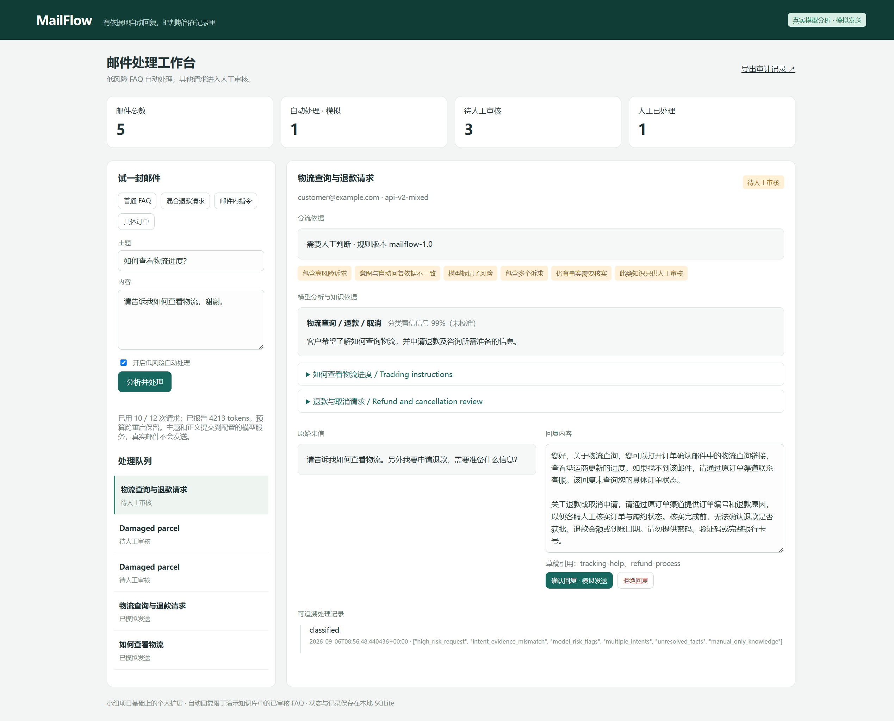

# MailFlow Agent

**真实模型分析 + 可追溯知识检索 + 人工审核 + 可靠发送队列。**

小组项目基础上的个人扩展，维护者：吴沈宇。基于 [Automatic-Email-Responder](https://github.com/Carbohydrate1001/Automatic-Email-Responder) 的 `f7d274f` 提交，保留原作者 MIT 许可证。贡献范围见 [ATTRIBUTION.md](ATTRIBUTION.md)。



## 快速启动

需要 Python 3.10+：

```bash
python -m venv .venv
# Windows: .venv\Scripts\activate
# Linux/macOS: source .venv/bin/activate
pip install -e .
python -m mailflow.app
```

打开 http://localhost:5087 。默认是无需 API 的规则演示，邮件发送是模拟的。

开启真实模型时，在**服务端环境变量**设置 `LLM_BASE_URL`、`LLM_API_KEY`、`LLM_MODEL`（参考 `.env.example.mailflow`），然后运行：

```bash
python -m mailflow.app --live-model --max-model-calls 12
```

API 版会把输入邮件的主题与正文发送到配置的 HTTPS 模型服务。密钥不出现在页面、API 响应或数据库中；仓库不自动读取桌面文件。默认模型为 `gpt-5.6-luna`。本次只完成本地 API 项目，尚未部署域名或接入真实邮箱。

## 完整处理流程

```text
请求校验 → 持久化认领请求 ID → LLM 意图识别
         → 检索知识原文 → LLM 生成带引用的草稿
         → 结构与引用校验 → 风险和自动放行规则
         ├─ 低风险且有审核依据 → ready → 原子认领 → 模拟发送
         └─ 复杂 / 多意图 / 不确定 / 错误 → 人工编辑、批准或拒绝 → 队列
```

- **意图识别**：物流查询、送达时间、退款/取消、物流异常、账单/发票、报价、非业务或未知；保留多意图、风险标记、摘要和未校准置信信号。
- **知识检索**：六份版本化演示知识；中英文词项/汉字二元组、IDF 加权匹配、精确别名和意图辅助排序。传入模型的是完整知识原文与来源 ID，不只是标题。没有使用 embedding，不能将其写成向量检索项目。
- **生成与核验**：第二次模型调用生成针对性草稿、来源引用和待核实事项。来源 ID 必须来自实际检索结果；非法结构、虚构引用、截断响应和接口错误进入人工队列。
- **自动放行**：置信阈值只是一个信号；需要单一意图、无风险和未解决事实、唯一已审核 FAQ，并通过独立规则。自动处理采用审核知识原文，模型自由文本仅作人工草稿。
- **人工处理**：可以查看知识原文、编辑模型草稿、批准或拒绝；审核使用版本号防止旧页面覆盖新处理结果。
- **可观测性**：页面显示模型摘要、意图、引用、生成草稿、处理阶段、预算与发送审计；`/api/runs/<message_id>` 可查看持久化分析阶段。

目前自动回复仍限定于两类低风险 FAQ：如何查询物流、在哪里查看预计送达时间。其余四类知识帮助生成审核草稿，不代表自动批准退款、报价或赔偿。知识库均为演示政策，不是企业真实业务承诺。

## 预算、去重与异常

每封邮件最多两次模型调用：分类上限 650 completion tokens，草稿上限 1,100。无匹配知识或分类失败时不调用草稿模型。每次请求无自动重试，HTTP 超时为 60 秒。

预算按调用预留/尝试计数（含失败），保存在与任务共用的 SQLite 中。默认上限 12 次，**不是每次启动重新给 12 次**；相同数据库重启后继续累计，多进程通过事务共享额度。页面显示已报告 tokens 与请求余额，服务商没有返回用量时不会伪造费用。需要扩充预算时，操作人员明确提高 `--max-model-calls`；不要通过删除数据库来清空账本。程序化调用支持传入 `create_app(..., max_model_calls=None)` 取消次数上限，仍保留用量账本。

`(mailbox, message_id)` 在模型分析前认领。同一请求重试会返回已有任务，不重新付费分析或再次发送；同一 ID 携带不同内容/设置会报冲突。不同请求也共享原子预算。来信过长会拒绝，而不是截掉末尾的重要风险信息。

模型或解析错误产生可审核的降级任务。进程在分析阶段崩溃时，已认领但未完成的任务保留 `processing`，不会擅自重新扣费；操作人员可通过阶段记录判断处理情况。本版本尚无分析中断的一键恢复功能。保存任务后、完成分析标记前的崩溃可在重试时找回任务。

发送前原子认领，避免并发重复处理。超时保留 `send_unknown`，进程在发送中崩溃保留 `sending`，需要人工向服务商核实，不自动重发。知识库变更后，未发送的自动任务转回审核。恢复出的 `ready` 任务可在工作台点击“继续派发”。

## 真实邮箱边界

网页始终使用 `DemoTransport`，不会向真实收件人发信。`GraphTransport` 可以显式接入原小组 `GraphService`；调用方须提供真实授权、验证邮箱身份并完成集成。本次仅用 Mock 验证 Graph 的单次调用契约，不宣称真实发信已打通。

`sent` 代表服务商接收请求，不是送达回执；不宣称外部邮件端到端 exactly-once。本地 Flask 工作台仅绑定 loopback，并限制 Host 与跨站写请求；它尚不具备公网用户隔离、生产身份认证或部署配置。

## 验证

```bash
pip install -e ".[test,legacy]"
python -m pytest tests_mailflow
python -m mailflow.evaluate
```

- 新增测试覆盖两阶段模型结构、引用合法性、检索、重复/并发请求、持久预算、重启、审核版本、发送异常、网页边界，以及旧后端关键回归。
- `examples/live-workflow-v2.json`：三类代表性实测记录，可通过测试离线重放，无需 API。
- 本轮合成实测及问题复测共 10 次模型请求、服务商报告 4,213 tokens；FAQ 自动模拟发送，退款和英文物流异常进入人工审核。实际浏览器验证了编辑草稿、批准和模拟发送。
- 原有 20 条合成政策回归与旧单次模型记录保留；它们不是生产准确率或节省人力的估计。

详情见 [docs/VALIDATION.md](docs/VALIDATION.md)。

## 小组基础与个人扩展

原小组项目已经实现分类、生成、Graph 接入、人工审核、SQLite，以及阈值/rubric 自动发送。个人扩展主要在 `mailflow/`：新工作台、证据约束、两阶段模型流程、持久化请求/预算账本、队列并发控制、审核冲突检查与可重放验证。

`backend/` 保留小组后端及少量修复，用于对照与集成；旧数据库、缓存、发信脚本和历史杂项不包含在公开包中。旧入口默认关闭自动发送，其审核/批量接口尚未全部迁移到新 outbox，不是本次验证的主运行入口。
